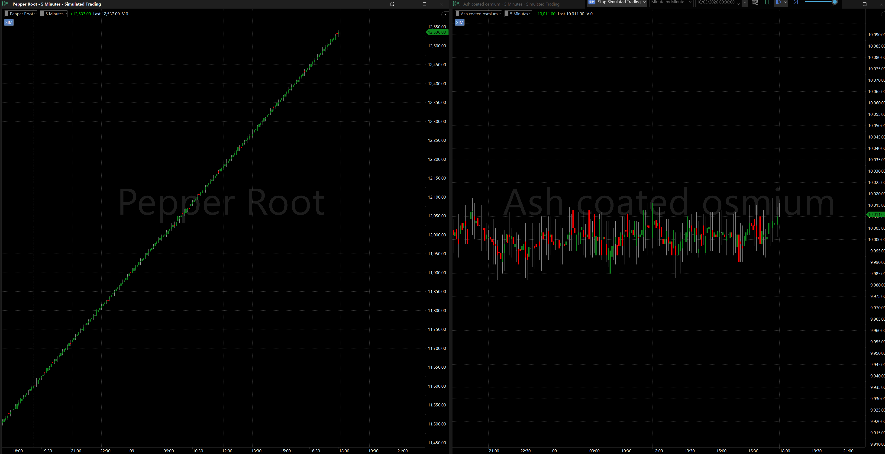
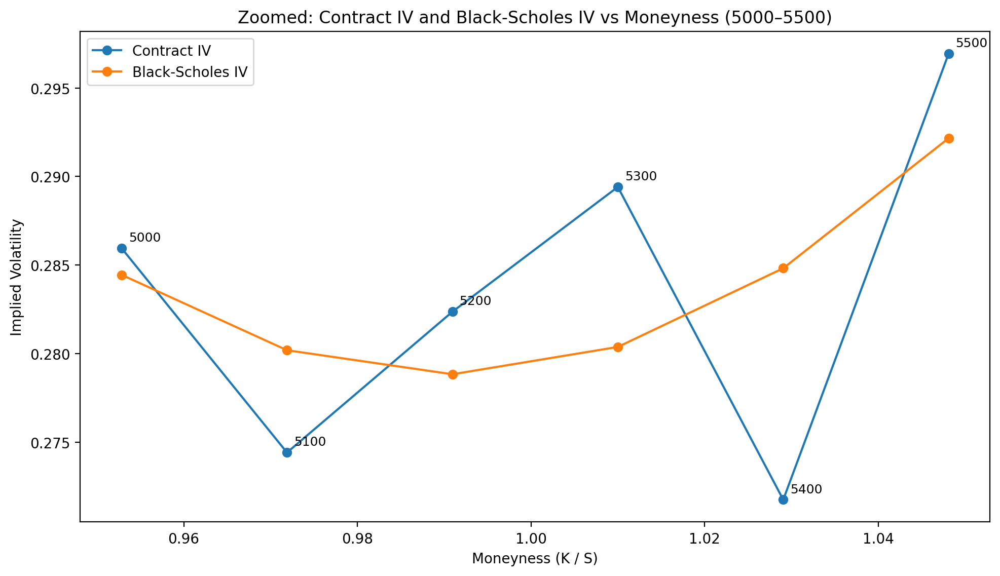
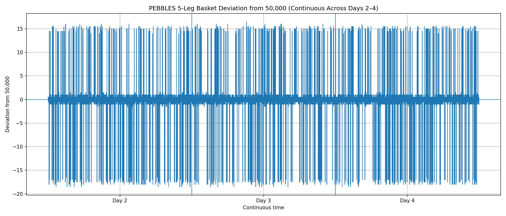

# IMC Prosperity 4 Algorithmic Write-Up

## 1. Competition Context

IMC Prosperity 4 was a fictional space-themed trading competition where we traded planetary products and tried to earn as many **XIRECs** as possible.

Even though the assets were made up, the trading problems were realistic. We had to deal with market making, bid-ask spreads, fair value, options pricing, mean reversion, bundle relationships and overfitting.

For each round, IMC gave us **three days of previous market data** to research and test on. They also gave us a backtester with only a small slice of the next day, around **10% of Day 4**, so we could sanity-check the bot before submission.

For the actual scoring, the trading algorithm was tested on hidden full evaluation data for that round. That final hidden test decided the real performance metrics.

For the algorithmic challenge, we submitted a Python bot that read market data and placed buy/sell orders.

- **Round 1:** trading ash coated osmium and intarian pepper root.
- **Round 2:** same products as round 1, plus the Market Access Fee auction.
- **Round 3:** Velvet Fruit Extract options book.
- **Round 4:** trade data from market makers, retail traders, and informed traders.
- **Round 5:** 50 different products across 10 bundles.


---

## 2. Tools Used

To build and improve the strategies, I used a few main tools.

### Monte Carlo Simulator

I used a Monte Carlo simulator to test strategy risk across different possible outcomes.  
It was **not** a random-walk simulator.  
It used the actual round data, then simulated realistic variations from that data.  
This helped test what could happen if the same market behaved slightly differently.  
It was mainly useful for stress-testing volatility, bad luck, and option risk.

### Backtesting Engine

The backtesting engine tested strategies on the three previous days of data given each round.  
It showed total PnL, product-level PnL, trades, and positions.  
I used it to compare different versions quickly.  
It helped show when a change improved the strategy or made it worse.  
It also helped catch overfitting before final submission.

### MultiCharts Visualizer

I converted the three days of data given each round and loaded it into **MultiCharts**.  
This let me view the products as visual candlestick charts.  
It helped me see trends, reversals, noisy products, and clean market-making products.  
This was especially useful in Round 5 with 50 products.  
The charts helped classify products and check whether the bot traded correctly.

### AI

I used AI as a research, coding, and writing assistant.  
It helped brainstorm strategies, debug code, and compare versions.  
It was useful for explaining option pricing and organizing ideas.  

---

## 3. My General Algorithmic Approach

Across the rounds, my process was:

1. Work out what type of product I was trading.
2. Estimate fair value.
3. Find when the market price was wrong.
4. Trade only when the edge was big enough.
5. Exit when the edge disappeared.
6. Increase size when the signal was stronger.
7. Avoid overfitting to the backtest.

no.7 was important because a backtest can lie. A strategy can look good on old data and still fail on new data. So I tried to move toward simple ideas that had a real reason behind them.

---

## Round 1: Trading Groundwork on Intara

### What the Round Was

Round 1 took place on **Intara**, where we established our first Trade Outpost.

The algorithmic challenge was to trade two Intarian goods:

- **Ash-Coated Osmium** (`ASH_COATED_OSMIUM`)
- **Intarian Pepper Root** (`INTARIAN_PEPPER_ROOT`)

Both products had a position limit of **80**.

This round was about building the first real trading bot and proving that we could turn simple products into profit.

### Assets Traded

| Asset | Position Limit | Strategy |
|---|---:|---|
| Ash-Coated Osmium | 80 | Market Making |
| Intarian Pepper Root | 80 | Buy-and-hold / extreme trend following |

## Ash-Coated Osmium Strategy

For **Ash-Coated Osmium**, I used a **market-making strategy**

The goal was to quote around a fair reference price, capture the bid-ask spread, and manage inventory carefully.

Instead of betting on one big directional move, the bot tried to make repeated small profits from the spread.

Simple idea:

```text
estimate fair value / reference price

if ask is cheap enough:
    buy

if bid is rich enough:
    sell

manage inventory so the bot does not get too long or too short
```

Ash-Coated Osmium was more volatile than Intarian Pepper Root, so inventory control mattered. The bot could not just keep buying or selling forever. It needed to stay balanced while capturing spread whenever the order book gave a good price.

### Intarian Pepper Root Strategy

For **Intarian Pepper Root**, I used more of a buy-and-hold / extreme trend-following strategy.

The product behaved almost like a manufactured or artificial instrument. Its price did not move naturally like a noisy normal market. It mostly kept going up in a very steady and constant way.

Because of that, the best idea was not to overtrade it. The bot mostly wanted to stay with the upward trend and hold the position.

```text
price keeps trending upward
stay long
avoid overtrading
only exit if something abnormal happens
```

So Intarian Pepper Root was basically treated as a strong artificial trend product.

### Flash-Dump Insurance Clause

The risk with trend following is that a strong trend can suddenly break.

So I added a flash-dump insurance clause.

If Intarian Pepper Root suddenly moved in a way that looked unprecedented or clearly broke the trend, the bot would exit quickly instead of holding through a crash.

```text
if trend is normal:
    keep holding

if price breaks trend sharply:
    exit fast
```

This let the bot ride the trend while still having emergency downside protection.
### Charts for both assets:



### Results

| Metric | Result |
|---|---:|
| Round 1 algorithmic PnL |+95,000 XIRECs|


---

## Round 2: Growing the Outpost and Market Access Fee

### What the Round Was

Round 2 was still on **Intara**.

We traded the same two products as Round 1:

- **Ash-Coated Osmium** (`ASH_COATED_OSMIUM`)
- **Intarian Pepper Root** (`INTARIAN_PEPPER_ROOT`)

Both still had a position limit of **80**.

The big new feature was the **Market Access Fee**, or MAF.

This let us bid for **25% more quotes in the order book**. If our bid was accepted, we got extra market access. If it was rejected, we traded the normal book and paid nothing.

### Assets Traded

| Asset | Position Limit | Strategy |
|---|---:|---|
| Ash-Coated Osmium | 80 | Market Making |
| Intarian Pepper Root | 80 | Buy-and-hold / extreme trend following |

### Strategy Refinement

The product strategies stayed similar to Round 1.

For **Ash-Coated Osmium**, I continued using the market making strategy from round 1 with a few changes

For **Intarian Pepper Root**, I kept the buy-and-hold / extreme trend-following idea. Since the product kept moving upward in a very artificial and steady way, the bot stayed with the trend unless the flash-dump rule triggered.

Round 2 was less about inventing a brand-new strategy and more about improving the Round 1 bot while deciding how much extra market access was worth.

### Market Access Fee Logic

The Market Access Fee was a blind auction.

The top 50% of bids got extra market access. If accepted, the bid was subtracted from final Round 2 profit.

```text
if bid accepted:
    final profit = trading profit - bid

if bid rejected:
    final profit = trading profit
```

So the bid had to be high enough to get accepted, but not so high that it destroyed the extra profit.

### How I Chose the Bid

In Round 1, the algorithm made around **98,000 XIRECs** in base PnL.

Extra market access gave around **25% more volume**, so I estimated the extra value as:

```text
25% of 98,000 ≈ 24,500 XIRECs
```

That meant the extra access could be worth around **24,500 XIRECs**.

But the important detail was that the fee was paid every **25,000 ticks**.

A full trading day had **100,000 ticks**, so the fee was paid **4 times**:

```text
100,000 ticks / 25,000 ticks = 4 payments
```

So if I bid around **6,000 XIRECs**, the full-day cost would be:

```text
6,000 × 4 = 24,000 XIRECs
```

That was very close to the expected extra profit from the 25% extra volume:

```text
expected extra profit ≈ 24,500 XIRECs
estimated access cost ≈ 24,000 XIRECs
```

So around **6,000 XIRECs per 25,000 ticks** was my break-even point.

I then placed the bid lower, around **4,000 XIRECs**, because I did not want to pay the full break-even value. I also compared the average PnL on the leaderboard to estimate what other teams might bid and what their break-even points might be.

```text
extra access could be worth about 24.5K total
6K per 25K ticks costs about 24K total
therefore 6K was near break-even
bid around 4K to keep more upside
```

### Results

| Metric | Result |
|---|---:|
| Round 2 algorithmic PnL before MAF |+95,000 XIRECs|
| Final Round 2 algorithmic PnL | [FILL IN] |

## Round 3: Velvet Fruit Extract Options and Hydrogel Packs

### What the Round Was

Round 3 had two underlying assets:

- **Velvet Fruit Extract**
- **Hydrogel Packs**

There was also a full European options book on **Velvet Fruit Extract**. All options had the same expiry, but different strikes:
- 4,000
- 4,500
- 5,000
- 5,100
- 5,200
- 5,300
- 5,400
- 5,500
- 6,000
- 6,500

in the options book there was also data for all the greeks, Implied volatility ect.. for the above strikes

So Round 3 had two parts:

1. Market making on Velvet Fruit Extract and Hydrogel Packs.
2. IV trading on the Velvet Fruit Extract options.

### Assets Traded

| Asset | What It Was | How I Used It |
|---|---|---|
| Velvet Fruit Extract | Underlying asset | Market making / bid-ask spread capture |
| Hydrogel Packs | Underlying asset | Market making / bid-ask spread capture |
| VFE options chain | Options on Velvet Fruit Extract | IV comparison and fair-value trading |

### Underlying Strategy: Market Making

For **Velvet Fruit Extract** and **Hydrogel Packs**, I used a market-making strategy.

```text
buy near the bid
sell near the ask
capture the spread
manage inventory
```

I was not trying to predict massive price moves in these two products. I was trying to repeatedly earn small profits from the **bid-ask spread**.

This ended up being very important. My options model did not trade well in Round 3. In fact, the options side was negative. The market making on Velvet Fruit Extract and Hydrogel Packs is what pushed me back into profit overall.

### Options Strategy, Delta Hedging, and the Critical Error

For the Velvet Fruit Extract options, I tried to use IV scalping.

The goal was not just to bet on the option price going up or down. The goal was to trade **implied volatility**.

To do that properly, we had to **delta hedge** the options chain using Velvet Fruit Extract. Delta hedging helped remove the directional risk from the underlying. That way, the strategy was more focused on whether the option’s implied volatility was too high or too low, instead of just whether Velvet Fruit Extract moved up or down.

```text
option market price → implied volatility → compare to fair IV → trade rich/cheap options → delta hedge with Velvet Fruit Extract
```

The mistake was the fair-value equation.

I used a **modified Black-Scholes implied-volatility equation**, but it was not good enough for this market. It looked reasonable in theory, but it did not trade well.


The problem was that the Velvet Fruit Extract options did not behave like clean textbook Black-Scholes options. 

So even though the delta hedge helped isolate implied volatility, the IV model itself was still weak. The options side gave bad signals and ended up negative.

That meant Round 3 only ended around **+1,000 XIRECs** because the market making on Velvet Fruit Extract and Hydrogel Packs recovered the losses.

But because the fair-value equation was weak and did not include varience, alot of IV noise triggered low quality entries, this was later solved by accountiung for varience in Implied volatility

### Results

| Metric | Result |
|---|---:|
| Round 3 algorithmic PnL | ~1,000 XIRECs |
| Rank after Round 3 | 2600th |

## Round 4: Same Products, Better Equation, Extra Trade Data

### What the Round Was

Round 4 used the **same products as Round 3**:

- **Velvet Fruit Extract**
- **Hydrogel Packs**
- the same Velvet Fruit Extract options chain

The options still had the same strikes:
- 4,000
- 4,500
- 5,000
- 5,100
- 5,200
- 5,300
- 5,400
- 5,500
- 6,000
- 6,500

The difference was that Round 4 gave us **trade data**.

That meant I could now look at who was trading, not just the order book.

Round 4 had three main improvements:

1. Keep market making Velvet Fruit Extract and Hydrogel Packs.
2. Improve the options fair-value equation by adding variance.
3. Use trade data to identify trader types.

### Assets Traded

| What was traded | What It Was | How I Used It |
|---|---|---|
| Velvet Fruit Extract | Underlying asset | Market making / spread capture |
| Hydrogel Packs | Underlying asset | Market making / spread capture |
| VFE options chain | Options on Velvet Fruit Extract | IV fair value now with variance |
| Trade data | Extra information | Trader classification and flow signals |

### Underlying Strategy: Market Making

For **Velvet Fruit Extract** and **Hydrogel Packs**, I kept the market-making strategy.

The bot quoted around fair value, bought when prices were attractive, sold when prices were attractive, and tried to capture the bid-ask spread.

This gave the strategy a stable base. Even if the options model had noise, the underlying market making helped smooth the PnL.

### Options Strategy: Why Variance Fixed the Model

This was the big improvement from Round 3.

In Round 3, I used a modified Black-Scholes-style IV equation. It sounded good, but it did not fit the market well. It treated the options too cleanly and ignored too much of the actual price movement.

In Round 4, I added **variance** into the fair-value calculation.

That was the real fix.


Adding variance made the model much more realistic. The model started reacting to real significant movement and not just noise.

We were still **delta hedging** the options with Velvet Fruit Extract. 

This made a huge difference. Round 3 made about **1,000 XIRECs**, and the options side was negative. Round 4 made about **10,000 XIRECs** because the model understood the options better.

The model changed from:

```text
modified Black-Scholes fair value
```

to:

```text
modified Black-Scholes fair value + variance adjustment
```
### Here is the Fair IV over the Contracts IV (according to our varienced black scholes model)



As you can see in the chart above the aim was to trade the mispricings of the contracts implied volatility back to what the equasion considers as fair value

### Rich-IV Strategy

The rich-IV logic stayed similar:

```text
IV edge = market IV - improved fair IV
```

If the option was rich after the variance adjustment, the bot could short it.

Then the bot used Velvet Fruit Extract to delta hedge the option exposure. This mattered because I wanted the trade to profit from the option being mispriced in volatility terms, not just from the underlying moving in my favour.

If the edge closed, the bot reduced or exited.

The 6,000 and 6,500 options were still important, but the signal was now much more trustworthy.

### Trader Classification

The other new tool was trade data.

With trade data, I could classify traders by their habits.

#### Market makers

Market makers usually traded a lot and traded both sides.

Their habits:

- high trade count;
- buys and sells both sides;
- usually close to fair value;
- often managing inventory.

I did not want to blindly follow them. Their trades were not always directional signals.

#### Noise / retail traders

Noise or retail traders had weaker trade behaviour.

Their habits:

- worse timing;
- chasing prices;
- buying rich options;
- selling cheap options;
- less consistent profitability.

This flow could be useful to fade.

#### Informed traders

Informed traders were the most useful group.

Their habits:

- better timing;
- trades before price moves;
- more consistent direction;
- better predictive value.

If informed traders agreed with my model, I could trust the trade more. If they traded against my model, I had to be careful.

```text
IV edge tells me what is mispriced
trade data tells me whether the flow agrees
```

### Leverage and Size

Round 4 was also about taking more size when the evidence was stronger.

The best trades had:

- a strong IV edge;
- the variance-adjusted model agreeing;
- trade data not warning against the trade.

```text
stronger evidence = bigger position
weaker evidence = smaller position
```

This was much better than just using max size everywhere.

### Results

| Metric | Result |
|---|---:|
| Round 4 algorithmic PnL | ~10,000 XIRECs |
| Rank after Round 4 | 1200th |


## Round 5: Multi-Product Basket Algorithm

### What the Round Was

Round 5 was the biggest algorithmic round.

There were **50 different products** to trade.

They were split into **10 bundles**, with **5 products in each bundle**.

This was not one simple strategy anymore. It was a full portfolio problem.

Every bundle needed a strategy choice:

- market making;
- mean reversion;
- trend following;
- basket arbitrage;
- spread trading;
- passive quoting;
- or avoiding the product if it was too noisy.


The final bot avoided:

- timestamp hardcoding;
- day-specific logic;
- PnL-based trading logic;
- double-trading the same product in multiple modules.

---

### Bundle Strategy Summary

| Bundle | Products | Strategy Used |
|---|---|---|
| **Panel** | 1x2, 1x4, 2x2, 2x4, 4x4 | trend following using fast/slow EMAs 
| **Pebbles** | XS, S, M, L, XL | Fixed fair-value added basket arbitrage around total fair value of about 50,000
| **Robots** | Dishes, Ironing, Laundry, Mopping, Vacuuming | Dynamic basket market making 
| **Snack Pack** | Chocolate, Vanilla, Pistachio, Raspberry, Strawberry |  mean reversion 
| **Oxygen Shake** | Chocolate, Evening Breath, Garlic, Mint, Morning Breath |  basket shock fade + SnackPack lead-lag signal
| **Galaxy Sounds** | Black Holes, Dark Matter, Planetary Rings, Solar Flames, Solar Winds | passive market making
| **Microchip** | Circle, Oval, Rectangle, Square, Triangle | passive market making  
| **Sleep Pod** | Cotton, Wool, Nylon, Polyester, Suede | passive market making 
| **Translator** | Astro Black, Eclipse Charcoal, Graphite Mist, Space Gray, Void Blue | passive market making 
| **UV Visor** | Amber, Magenta, Orange, Red, Yellow | passive market making 
---
### View Charts for each product here:
[View Round 5 Candlestick Charts.PDF](round5_all_products_candlestick_charts.pdf)
### Main Strategy Idea

Because there were 50 products, I could not use one strategy for everything.

The first job was to classify each bundle.

For each bundle, I asked:

```text
Does this bundle trend?
Does it mean revert?
Can the five products form a basket?
Can one product be priced from the others?
Is this better for passive market making?
Is this too noisy to trade aggressively?
```

The final bot used specialized modules for the bundles where I found stronger structure.

Specialized modules were used for:

- Panel;
- Pebbles;
- Robots;
- Snack Pack;
- Oxygen Shake;
- Galaxy Sounds.

Generic market making was used for:

- Microchip;
- Sleep Pod;
- Translator;
- UV Visor.


### Panel: Defensive Trend Following

Panel was a directional trend-following module.

The bot calculated:

- fast EMA;
- slow EMA;
- scale estimate.

### Pebbles: Fixed Fair-Value Basket Strategy

Pebbles was treated as a basket with a total fair value of about **50,000** when adding all the products together.



this looked attractive for market making

The idea was:

```text
if the full basket is cheap:
    buy all Pebbles legs together

if the full basket is rich:
    sell all Pebbles legs together

if there is no full-basket opportunity:
    market make each Pebble around synthetic fair value
```

The synthetic fair value for one Pebble was based on:

```text
total basket fair value - mid price of the other Pebbles
```

This meant each Pebble could be priced using the rest of the bundle.


### Robots: Dynamic Basket Market Making

Robots used dynamic basket market making.

The bot kept an EMA anchor for the total Robot basket.

Then it calculated:

```text
basket residual = current basket value - EMA anchor
```

Simple logic:

```text
positive residual → basket looks rich → lean sell-side
negative residual → basket looks cheap → lean buy-side
```

Each Robot product was quoted from a synthetic fair value based on the basket anchor and the other Robot mids.


### Snack Pack v5: Hybrid Pair and Triad Strategy

Snack Pack had two separate behaviours.

Chocolate and Vanilla used a passive pair shock-fade strategy.

Pistachio and Strawberry used a more active triad mean-reversion strategy, with Raspberry included in the signal but not forced into the same aggressive position.

Simple structure:

```text
Chocolate / Vanilla → passive pair shock fade
Pistachio / Strawberry → active triad mean reversion
Raspberry → defensive only
```

### Oxygen Shake v7: Basket Fade plus SnackPack Lead-Lag

Oxygen traded passively.

It combined:

1. Oxygen basket shock fade.
2. SnackPack lead-lag context.
3. Own-move fade for Chocolate and Evening Breath.
4. Soft dynamic-risk edge widening.

Simple idea:

```text
positive expected Oxygen move → raise fair value and favour bids
negative expected Oxygen move → lower fair value and favour asks
```


### Galaxy Sounds v3: Ring7 Even-Size Passive Market Making

Galaxy Sounds used a simple passive market-making module.

The goal was to avoid over-filtering and keep the strategy clean.


Planetary Rings used a wider edge because it needed more protection.

Quote size depended on Galaxy basket shock strength:

Galaxy did **not** use active crossing. It stayed passive.


### Generic MM v2.3: Microchip, Sleep Pod, Translator, and UV Visor

The generic market-making module traded:

- Microchip;
- Sleep Pod;
- Translator;
- UV Visor.

These products used bundle-aware passive market making around the current mid.

Generic MM settings:

```text
Microchip edge  = 2
Sleep Pod edge  = 2
Translator edge = 2
UV Visor edge   = 4
base size       = 3
```

The strategy did not cross the spread for entry. It quoted passively around fair value.


### Candlestick Chart Appendix

I also created a PDF with candlestick charts for all 50 Round 5 products.

The charts show the products across **Day 2, Day 3, and Day 4**, with each candle built from **100 timestamps**.

This PDF should be attached as the chart appendix:

```text
round5_all_products_candlestick_charts (3).pdf
```

---

### Results

| Metric | Result |
|---|---:|
| Round 5 algorithmic PnL | [FILL IN] |
| Final Round 5 rank | [FILL IN] |

---

# Final Lessons Learned

Overall, the biggest lesson from IMC Prosperity 4 was that a strong algorithm needs more than a good signal.  
Each product needed the right strategy: market making, mean reversion, trend following, basket trading, or options pricing.  
Backtests were useful, but they were not enough, because a strategy could look good on old data and fail on hidden data.  
Fair value was the core idea across every round, whether I was quoting spreads, pricing options, or comparing basket products.  
Risk control mattered just as much as profit, especially with position limits, inventory, delta hedging, and sizing.  
Round 3 taught me that a model can sound right and still trade badly if it does not fit the actual market.  
Round 4 showed how improving the model with variance and trade data could make the same idea much stronger.  
Round 5 showed that a final bot is really a portfolio of strategies, not one single strategy.  
The best improvements came from making the logic simpler, cleaner, and easier to explain.  


---


